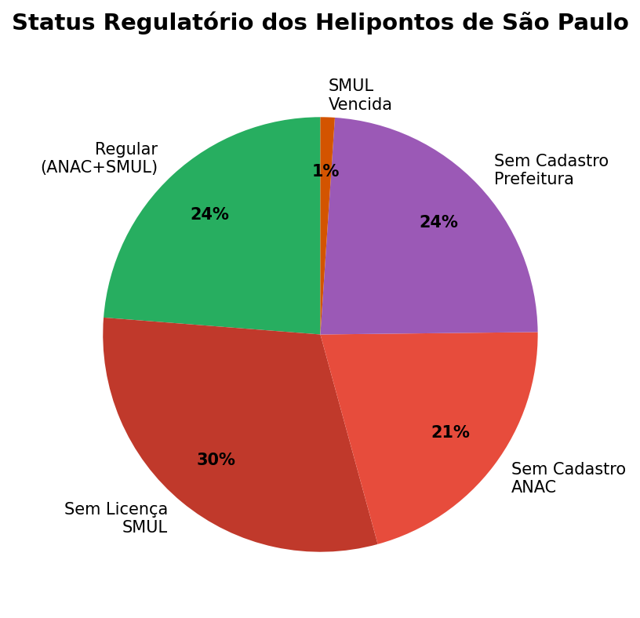
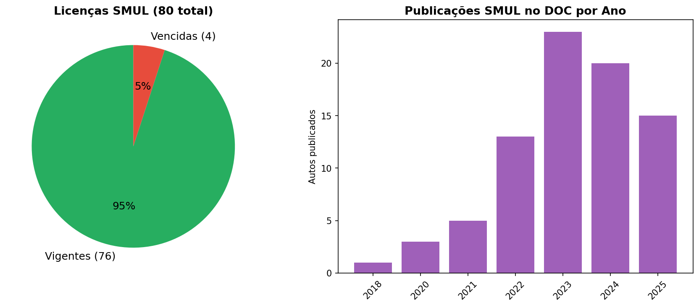
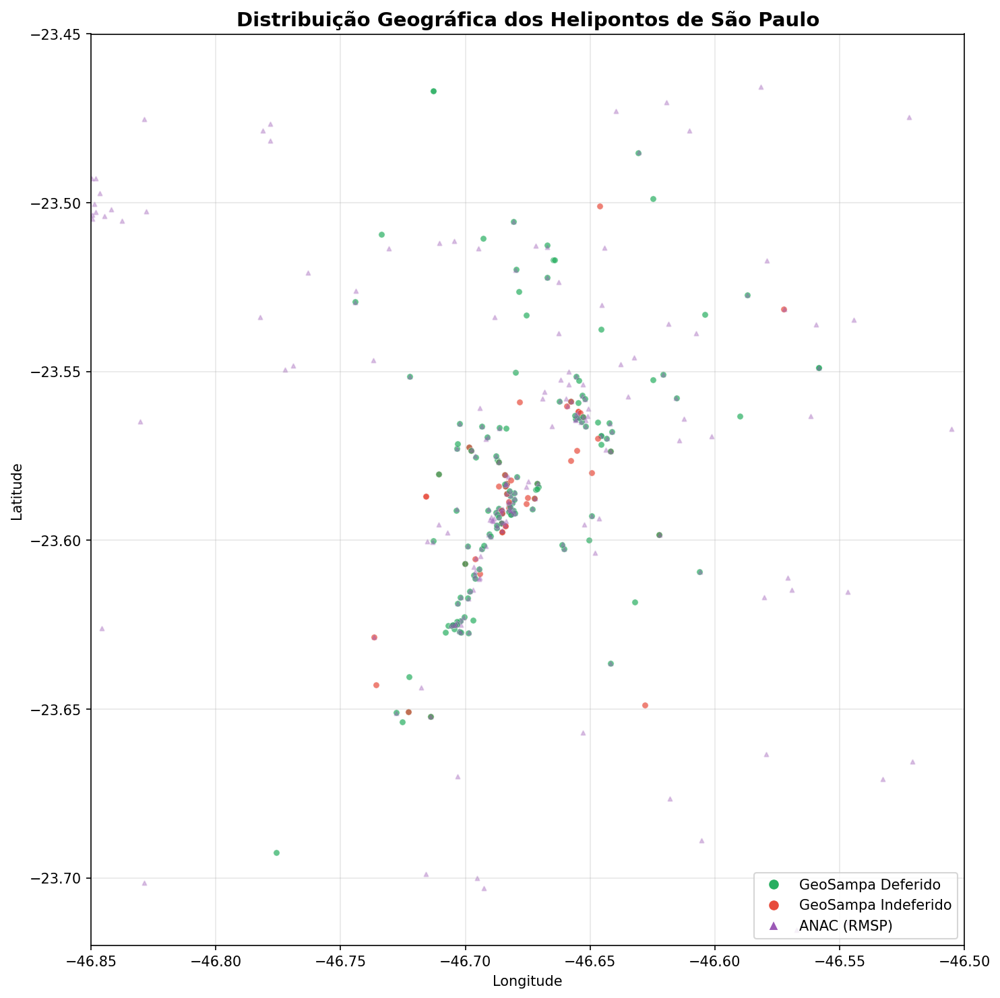
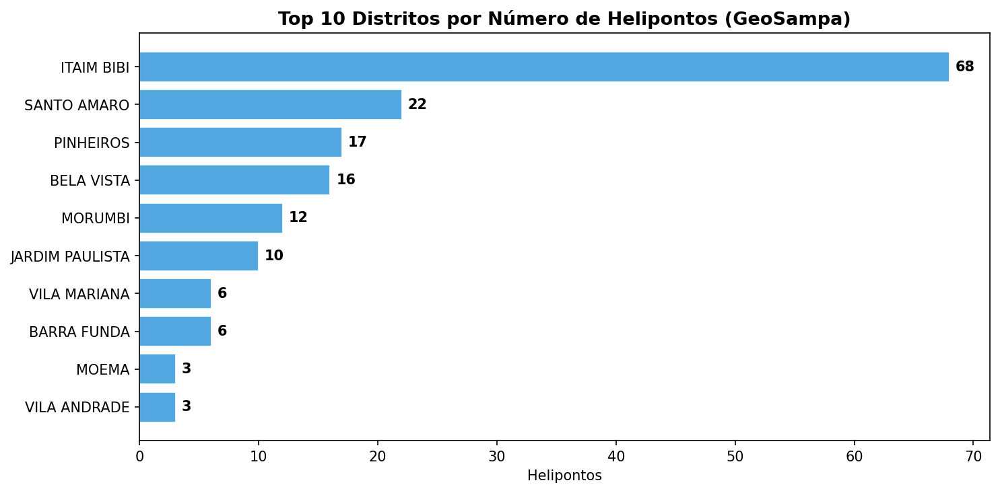
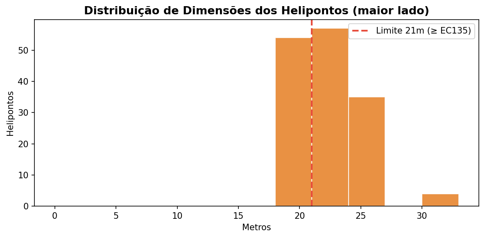
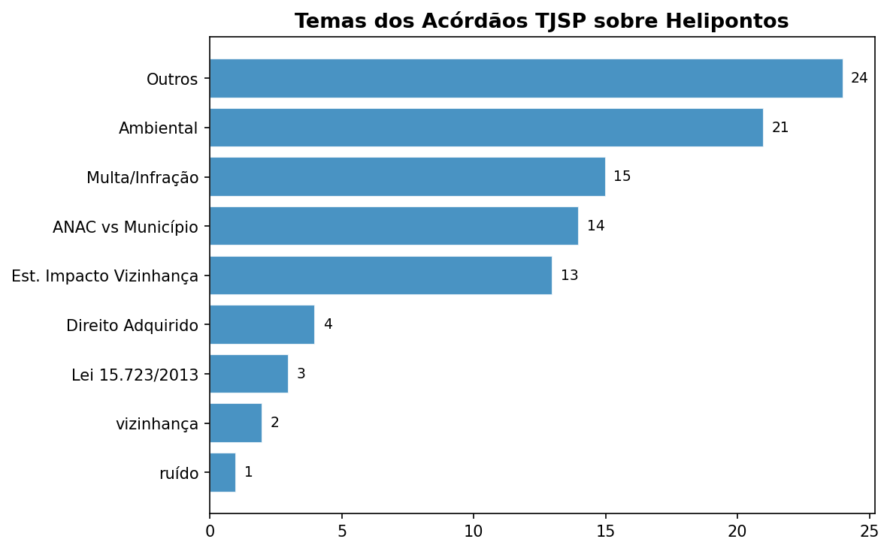
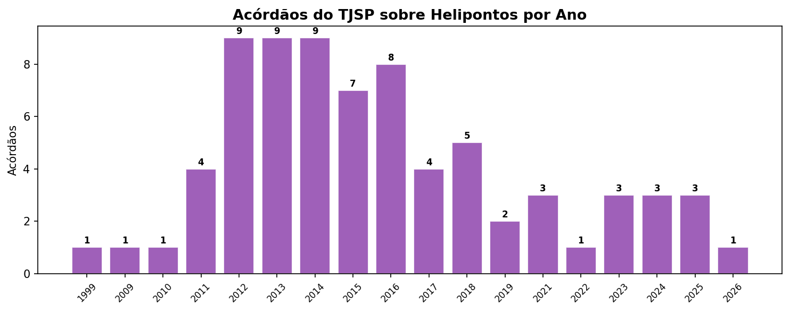
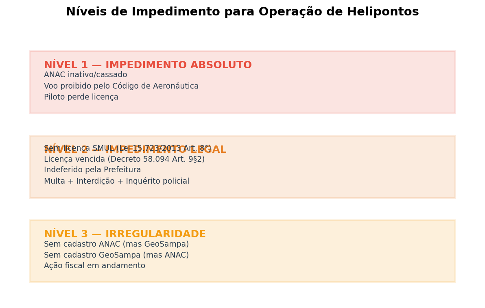

# Relatório Completo — Helipontos de São Paulo

> **Cruzamento de dados: ANAC (Federal) × GeoSampa (Prefeitura) × SMUL (Licença Municipal) × AISWEB (DECEA) × Diário Oficial × TJSP**
>
> Gerado em abril de 2026

---

## 1. Resumo Executivo

Este relatório consolida a análise de **todas as bases de dados públicas** sobre helipontos na Região Metropolitana de São Paulo, cruzando informações federais (ANAC, AISWEB/DECEA), municipais (GeoSampa, SMUL/CONTRU) e judiciais (TJSP).

### Números-chave

| Indicador | Valor |
|-----------|-------|
| Helipontos registrados na ANAC (SP) | **245** |
| Helipontos no GeoSampa (Prefeitura) | **201** |
| Licenças SMUL emitidas | **80** |
| Licenças SMUL vigentes | **76** |
| Licenças SMUL vencidas | **4** |
| Helipontos com dimensões ≥ 21×21m | **96** |
| Processos SMUL no Diário Oficial | **151** |
| Acórdãos TJSP sobre helipontos | **74** |

### Achados principais

1. **Apenas ~24% dos helipontos estão plenamente regulares** (cadastro ANAC ativo + licença SMUL vigente).
2. **52 helipontos foram indeferidos pela Prefeitura** no GeoSampa — processo negado.
3. **A CONTRU está fiscalizando ativamente**: 151 processos SMUL publicados no Diário Oficial desde 2023, dos quais 94 mencionam ação fiscal.
4. **74 acórdãos do TJSP** consolidam teses como: ANAC não supre licença municipal, interdição por falta de auto SMUL é legal, EIV é obrigatório.
5. **4 autos de multa concretos** foram identificados no DOC por operação sem licença de funcionamento.

---

## 2. Metodologia

### 2.1 Fontes de dados

| Fonte | Tipo | Cobertura | Acesso |
|-------|------|-----------|--------|
| **ANAC** | Registro federal de aeródromos | 245 helipontos (UF=SP) | Dados abertos (CSV) |
| **GeoSampa** | Cadastro municipal (WFS) | 201 helipontos (capital) | WFS / GeoJSON |
| **SMUL** | Autos de Licença de Funcionamento | 80 licenças | Planilha XLSX (portal Prefeitura) |
| **AISWEB/ROTAER** | Dimensões, superfície, MTOW | 150 helipontos | Web scraping (DECEA) |
| **Diário Oficial (DOC)** | Publicações oficiais da Prefeitura | 173 processos | Busca automatizada |
| **TJSP (CJSG)** | Jurisprudência — ac��rdãos | 360 resultados (74 relevantes) | Script R (ESAJ) |

### 2.2 Estratégia de cruzamento

O cruzamento GeoSampa × ANAC utiliza uma estratégia **multi-passe**:

1. **Código OACI exato** — match direto pelo código (mais confiável)
2. **Proximidade espacial** — sjoin_nearest dentro de 100m (UTM 23S)
3. **Correspondência por nome** — normalização e match fuzzy

### 2.3 Classificação de status

Cada heliponto recebe um **status consolidado** baseado no cruzamento das três bases:

| Status | Critério |
|--------|----------|
| **REGULAR** | Cadastro ANAC ativo + Licença SMUL vigente |
| **SEM_LICENÇA_SMUL** | Ativo na ANAC + GeoSampa, mas sem licença SMUL |
| **NÃO_CADASTRADO_ANAC** | No GeoSampa, mas sem registro ANAC |
| **NÃO_CADASTRADO_PREFEITURA** | Na ANAC, mas sem cadastro GeoSampa |
| **INDEFERIDO_PREFEITURA** | Processo negado pela Prefeitura |
| **LICENÇA_SMUL_VENCIDA** | Tem licença SMUL, porém vencida |
| **DIVERGENTE_ANAC_INATIVO** | Registro ANAC inativo/cancelado |

---

## 3. Panorama Geral

### 3.1 ANAC (Federal)

| Indicador | Valor |
|-----------|-------|
| Total de helipontos registrados (SP) | 245 |
| Operação dia e noite (VFR) | 222 |
| Apenas diurno (VFR Diurna) | 23 |
| Privados (PRIV) | 241 |
| Militares (MIL) | 4 |
| Todos ativos | Sim — nenhum marcado como inativo |

### 3.2 GeoSampa (Prefeitura)

| Indicador | Valor |
|-----------|-------|
| Total cadastrados | 201 |
| Deferidos | 149 |
| **Indeferidos** | **52** |

### 3.3 SMUL (Licença de Funcionamento)

| Indicador | Valor |
|-----------|-------|
| Licenças emitidas | 80 |
| Vigentes | 76 |
| **Vencidas** | **4** |

### 3.4 Distribuição geográfica

---

## 4. Situação Regulatória

### 4.1 CADES vs SMUL — processos distintos

É fundamental entender que **CADES e SMUL são processos independentes**, ambos publicados no Diário Oficial:

| Processo | Órgão | Número | Natureza |
|----------|-------|--------|----------|
| **Parecer CADES** | SVMA (Meio Ambiente) | 6027.xxxx | Aprovação **ambiental** (EIV-RIV) |
| **Auto SMUL** | CONTRU (Urbanismo) | 6068.xxxx | **Licença de funcionamento** |

Ter parecer CADES deferido **não significa** ter licença SMUL vigente. São trâmites separados.

### 4.2 Decreto 58.094/2018

Conforme o **Art. 9º §2º** do Decreto 58.094/2018:
- O Auto de Licença de Funcionamento é válido por **5 anos**
- Deve ser revalidado quando expirar o prazo ANAC (se menor)
- É expedido a **título precário** (pode ser cassado a qualquer tempo)

### 4.3 Deferidos sem licença SMUL

Dos 149 helipontos deferidos no GeoSampa, a grande maioria **não possui licença SMUL na planilha**. A própria Prefeitura esclarece:

> *"Demais helipontos aprovados anteriormente à publicação do Decreto nº 58.094/2018 serão incorporados ao presente cadastro quando das respectivas revalidações das suas licenças."*

---

## 5. Lista Completa — Helipontos ≥ 21×21m

Helipontos com pelo menos uma dimensão ≥ 21 metros, ordenados por área. Dimensões e MTOW obtidos do AISWEB/ROTAER (DECEA).

| # | OACI | Nome | Dim. | MTOW | Operação | GeoSampa | SMUL | Distrito | Ciclos |
|---|------|------|------|------|----------|----------|------|----------|--------|
| 1 | SDCY | São Paulo Corporate Towers | 30×30 m | 18.0 t | VFR | Deferido | Sem licença | ITAIM BIBI | 4 |
| 2 | SDMN | Continental Tower | 30×30 m | 10.0 t | VFR | Deferido | Sem licença | MORUMBI | 4 |
| 3 | SDPM | Palácio dos Bandeirantes | 30×30 m | 10.0 t | VFR | Deferido | Sem licença | MORUMBI | 3 |
| 4 | SDVR | Pátio Victor Malzoni | 30×30 m | 18.0 t | VFR | Deferido | Vigente (09/02/2028) | ITAIM BIBI | 6 |
| 5 | SDDS | Sucupira | 26×26 m | 5.0 t | VFR | Deferido | Sem licença | SANTO AMARO | 2 |
| 6 | SIDE | Polícia Federal | 26×26 m | 6.0 t | VFR | Sem cadastro | Sem licença | — | — |
| 7 | SD2H | Torre Jequitibá | 24×24 m | 6.0 t | VFR | Sem cadastro | Vigente (26/07/2032) | — | — |
| 8 | SD3C | Thera Corporate | 24×24 m | 6.0 t | VFR | Sem cadastro | Sem licença | — | — |
| 9 | SD3T | Trimais Center | 24×24 m | 5.5 t | VFR | Sem cadastro | Sem licença | — | — |
| 10 | SDBR | REC Berrini | 24×24 m | 6.0 t | VFR | Deferido | Sem licença | ITAIM BIBI | 3 |
| 11 | SDDH | Birmann 29 | 24×24 m | 6.0 t | VFR | Deferido | Sem licença | ITAIM BIBI | 4 |
| 12 | SDSX | ITM Expo | 24×24 m | 6.0 t | VFR | Sem cadastro | Vigente (29/01/2029) | — | — |
| 13 | SDSZ | Banco Safra | 24×24 m | 6.0 t | VFR | Sem cadastro | Vencida (24/12/2025) | — | — |
| 14 | SDTU | Itaúsa | 24×24 m | 4.0 t | VFR | Deferido | Sem licença | JABAQUARA | 1 |
| 15 | SDVU | Conde Francisco Matarazzo | 24×24 m | 6.0 t | VFR | Sem cadastro | Vigente (09/02/2028) | — | — |
| 16 | SIBH | Helicidade | 24×24 m | 6.0 t | VFR | Sem cadastro | Vigente (29/12/2027) | — | — |
| 17 | SIBS | E-Business Bosque | 24×24 m | 6.0 t | VFR | Sem cadastro | Sem licença | — | — |
| 18 | SIJD | João Dias | 24×24 m | 5.0 t | VFR | Sem cadastro | Sem licença | — | — |
| 19 | SIJF | Edifício Faria Lima Financial Ce | 24×24 m | 6.0 t | VFR | Indeferido | Vigente (18/06/2029) | ITAIM BIBI | — |
| 20 | SIJX | Internacional Plaza | 24×24 m | 6.0 t | VFR | Sem cadastro | Vigente (02/09/2029) | — | — |
| 21 | SIKF | Plaza Iguatemi | 24×24 m | 10.0 t | VFR | Deferido | Vigente (03/12/2030) | PINHEIROS | 13 |
| 22 | SIQM | Morumbi Corporate | 24×24 m | 6.0 t | VFR | Sem cadastro | Vigente (02/01/2029) | — | — |
| 23 | SIRY | Hiper-Bergamini | 24×24 m | 6.0 t | VFR | Sem cadastro | Sem licença | — | — |
| 24 | SIUD | Monte Horebe | 24×24 m | 6.0 t | VFR | Sem cadastro | Vigente (28/11/2029) | — | — |
| 25 | SIXS | EZ Towers A | 24×24 m | 15.0 t | VFR | Deferido | Sem licença | SANTO AMARO | 3 |
| 26 | SJBO | EZ Towers B | 24×24 m | 15.0 t | VFR | Deferido | Sem licença | SANTO AMARO | 4 |
| 27 | SJFC | Federação do Comércio do Estado  | 24×24 m | 6.0 t | VFR | Deferido | Vigente (26/09/2028) | BELA VISTA | 7 |
| 28 | SJOZ | Faria Lima Square | 24×24 m | 6.0 t | VFR | Indeferido | Vigente (22/07/2027) | ITAIM BIBI | — |
| 29 | SJPB | Guarapiranga Golf | 24×24 m | 8.5 t | VFR | Sem cadastro | Sem licença | — | — |
| 30 | SJRQ | Hospital São Camilo Pompéia | 24×24 m | 5.0 t | VFR | Sem cadastro | Sem licença | — | — |
| 31 | SJSL | Hospital Sírio Libanês II | 24×24 m | 7.0 t | VFR | Deferido | Sem licença | BELA VISTA | 25 |
| 32 | SJXK | Eldorado | 24×24 m | 10.0 t | VFR | Deferido | Vigente (18/10/2029) | PINHEIROS | 2 |
| 33 | SNPH | Rei da Pamonha | 24×24 m | 6.0 t | VFR | Sem cadastro | Sem licença | — | — |
| 34 | SSKL | JK 1455 | 24×24 m | 6.0 t | VFR | Deferido | Vigente (20/08/2027) | ITAIM BIBI | 2 |
| 35 | SSPQ | Hospital da Polícia Militar | 24×24 m | 5.0 t | VFR | Sem cadastro | Sem licença | — | — |
| 36 | SSVH | Henri Dunant | 24×24 m | 6.0 t | VFR | Deferido | Sem licença | SANTO AMARO | 2 |
| 37 | SSXK | Kartódromo Ayrton Senna | 24×24 m | 15.0 t | VFR | Sem cadastro | Sem licença | — | — |
| 38 | SWTF | JBS | 24×24 m | 6.0 t | VFR | Sem cadastro | Sem licença | — | — |
| 39 | SWYD | Spazio Faria Lima | 24×24 m | 6.0 t | VFR | Deferido | Vigente (10/01/2028) | ITAIM BIBI | 3 |
| 40 | SDRN | Zarzur | 23×23 m | 4.5 t | VFR | Sem cadastro | Vigente (25/05/2027) | — | — |
| 41 | SD6M | Parque da Cidade Torre B1 | 22×22 m | 5.0 t | VFR | Sem cadastro | Sem licença | — | — |
| 42 | SD6Q | Parque da Cidade Torre B2 | 22×22 m | 5.0 t | VFR | Sem cadastro | Sem licença | — | — |
| 43 | SD6R | Parque da Cidade Torre B3 | 22×22 m | 5.0 t | VFR | Sem cadastro | Sem licença | — | — |
| 44 | SIMM | Edifício Corporate Park | 22×22 m | 5.0 t | VFR | Indeferido | Vigente (10/01/2028) | ITAIM BIBI | — |
| 45 | SBOP | Arena Corinthians | 21×21 m | 5.0 t | VFR | Sem cadastro | Sem licença | — | — |
| 46 | SDAT | Hospital e Maternidade Vitória | 21×21 m | 5.0 t | VFR | Sem cadastro | Sem licença | — | — |
| 47 | SDDG | Hospital Samaritano | 21×21 m | 4.5 t | VFR | Sem cadastro | Sem licença | — | — |
| 48 | SDEL | Condomínio Edifício Spazio JK | 21×21 m | 4.5 t | VFR | Indeferido | Sem licença | ITAIM BIBI | — |
| 49 | SDFW | Condomínio Edifício San Paolo | 21×21 m | 4.5 t | VFR | Deferido | Vigente (26/09/2029) | PINHEIROS | 3 |
| 50 | SDGG | Aché Faria Lima | 21×21 m | 4.5 t | VFR | Sem cadastro | Sem licença | — | — |
| 51 | SDHI | Hospital Edmundo Vasconcelos | 21×21 m | 4.5 t | VFR | Sem cadastro | Sem licença | — | — |
| 52 | SDIA | Cidade | 21×21 m | 4.2 t | VFR | Sem cadastro | Vigente (29/12/2027) | — | — |
| 53 | SDKV | Rede Globo | 21×21 m | 10.0 t | VFR | Sem cadastro | Vigente (06/05/2027) | — | — |
| 54 | SDKY | Hospital das Clínicas | 21×21 m | 3.0 t | VFR | Sem cadastro | Sem licença | — | — |
| 55 | SDN3 | Hospital Militar da Área de São  | 21×21 m | 5.0 t | VFR | Sem cadastro | Sem licença | — | — |
| 56 | SDNR | Banco Santander | 21×21 m | 4.0 t | VFR | Deferido | Vigente (27/07/2028) | SANTO AMARO | 10 |
| 57 | SDOF | Edifício Palladio | 21×21 m | 4.5 t | VFR | Sem cadastro | Vigente (21/05/2029) | — | — |
| 58 | SDQC | HELPN Quarto COMAR | 21×21 m | 4.0 t | VFR DIURNA | Sem cadastro | Sem licença | — | — |
| 59 | SDSN | São Luiz | 21×21 m | 4.0 t | VFR | Deferido | Sem licença | ITAIM BIBI | 2 |
| 60 | SDTG | Edifício Atrium IV | 21×21 m | 4.0 t | VFR | Deferido | Vigente (14/10/2030) | ITAIM BIBI | 2 |
| 61 | SDTJ | Edifício Atrium V | 21×21 m | 4.2 t | VFR | Sem cadastro | Sem licença | — | — |
| 62 | SDWB | CYK | 21×21 m | 5.0 t | VFR | Deferido | Sem licença | JARDIM PAULISTA | 2 |
| 63 | SDWT | World Trade Center | 21×21 m | 4.0 t | VFR | Sem cadastro | Vigente (13/01/2030) | — | — |
| 64 | SDXQ | Internacional Plaza II | 21×21 m | 4.5 t | VFR | Sem cadastro | Vigente (02/09/2029) | — | — |
| 65 | SI49 | WT Morumbi | 21×21 m | 4.2 t | VFR | Sem cadastro | Sem licença | — | — |
| 66 | SIHD | Divena | 21×21 m | 4.0 t | VFR | Deferido | Sem licença | CURSINO | 2 |
| 67 | SIIH | Torre 2000 | 21×21 m | 5.0 t | VFR | Deferido | Sem licença | PINHEIROS | 5 |
| 68 | SIIR | Brascan Century Plaza | 21×21 m | 4.5 t | VFR | Sem cadastro | Vigente (14/06/2029) | — | — |
| 69 | SILF | New Century | 21×21 m | 4.2 t | VFR | Deferido | Vigente (06/12/2028) | ITAIM BIBI | 3 |
| 70 | SILV | VOCP | 21×21 m | 4.5 t | VFR | Sem cadastro | Vigente (24/07/2026) | — | — |
| 71 | SIOD | DIMEP | 21×21 m | 4.5 t | VFR | Deferido | Vigente (17/08/2028) | VILA LEOPOLDINA | 3 |
| 72 | SIRO | Maksoud Plaza | 21×21 m | 4.0 t | VFR | Sem cadastro | Vigente (06/12/2028) | — | — |
| 73 | SITO | Berrini One | 21×21 m | 4.5 t | VFR | Deferido | Vigente (18/12/2028) | ITAIM BIBI | 15 |
| 74 | SIYU | Edifício Ronaldo Sampaio Ferreir | 21×21 m | 5.0 t | VFR | Sem cadastro | Vigente (19/10/2026) | — | — |
| 75 | SJBG | Birmann 31 | 21×21 m | 4.0 t | VFR | Deferido | Sem licença | ITAIM BIBI | 4 |
| 76 | SJBP | Atrium VI.com | 21×21 m | 4.0 t | VFR | Deferido | Sem licença | ITAIM BIBI | 2 |
| 77 | SJDD | Jardim das Perdizes | 21×21 m | 4.5 t | VFR | Deferido | Sem licença | BARRA FUNDA | 6 |
| 78 | SJEB | Millennium Office Park | 21×21 m | 4.2 t | VFR | Sem cadastro | Sem licença | — | — |
| 79 | SJEI | New England | 21×21 m | 12.0 t | VFR | Sem cadastro | Vigente (03/09/2029) | — | — |
| 80 | SJNS | Grupo Souza Lima  | 21×21 m | 4.0 t | VFR | Sem cadastro | Sem licença | — | — |
| 81 | SJTD | Plaza JK | 21×21 m | 4.5 t | VFR | Sem cadastro | Vigente (20/06/2028) | — | — |
| 82 | SJWJ | HPE | 21×21 m | 5.0 t | VFR | Sem cadastro | Sem licença | — | — |
| 83 | SJWZ | E-Tower | 21×21 m | 4.5 t | VFR | Sem cadastro | Vigente (26/08/2030) | — | — |
| 84 | SJZU | Seculum | 21×21 m | 4.5 t | VFR | Indeferido | Sem licença | ITAIM BIBI | — |
| 85 | SN66 | Birmann 32 | 21×21 m | 4.5 t | VFR | Deferido | Sem licença | ITAIM BIBI | 4 |
| 86 | SNID | ICESP - Instituto do Câncer do E | 21×21 m | 4.5 t | VFR | Sem cadastro | Sem licença | — | — |
| 87 | SNLR | Itautec | 21×21 m | 5.0 t | VFR | Indeferido | Sem licença | TATUAPE | — |
| 88 | SS4B | Avenida Consolação 1601 | 21×21 m | 4.5 t | VFR | Sem cadastro | Sem licença | — | — |
| 89 | SSCS | Continental Square | 21×21 m | 6.0 t | VFR | Indeferido | Sem licença | ITAIM BIBI | — |
| 90 | SSQX | Frei Caneca Shopping | 21×21 m | 4.5 t | VFR | Sem cadastro | Sem licença | — | — |
| 91 | SSQY | Centro Empresarial de São Paulo | 21×21 m | 5.0 t | VFR | Deferido | Sem licença | JARDIM SAO LUIS | 5 |
| 92 | SSUF | Rede D'Or São Luiz Anália Franco | 21×21 m | 4.5 t | VFR | Deferido | Sem licença | TATUAPE | 3 |
| 93 | SWEL | Limão | 21×21 m | 4.5 t | VFR | Deferido | Sem licença | LIMAO | 2 |
| 94 | SWHH | Banco Santander | 21×21 m | 4.0 t | VFR | Deferido | Vigente (27/07/2028) | ITAIM BIBI | 11 |
| 95 | SWHX | Conjunto Hospitalar do Mandaqui | 21×21 m | 4.5 t | VFR | Deferido | Sem licença | SANTANA | 16 |
| 96 | SWRV | Rochaverá - Alfa | 21×21 m | 4.2 t | VFR | Deferido | Sem licença | SANTO AMARO | 6 |

**Legenda:**
- **Operação**: VFR = dia e noite; VFR DIURNA = apenas diurno
- **GeoSampa**: Deferido / Indeferido / Sem cadastro
- **SMUL**: Vigente (data) / Vencida (data) / Sem licença
- **Ciclos**: Número máximo de pousos+decolagens diários autorizados pela Prefeitura

---

## 6. Fiscalização — Diário Oficial da Cidade de São Paulo

### 6.1 Processos no DOC

| Indicador | Valor |
|-----------|-------|
| Processos SMUL/CONTRU (6068.xxxx) | 151 |
| Total de processos sobre helipontos | 173 |
| Não constam na planilha SMUL | ~119 |
| Com ação fiscal | ~94 |

A maioria das publicações são **"Comunique-se"** (notificações de ALFH — Auto de Licença de Funcionamento de Heliponto) e **"Despacho Documental"** referentes a ações fiscais.

### 6.2 Autos de multa identificados

Foram encontrados **4 autos de multa concretos** publicados no DOC:

| Data | Auto de Multa | Fundamentação |
|------|---------------|---------------|
| 04/04/2025 | Auto Fiscalização 13-01.012.383-2 | Art. 142 Lei 16.402 |
| 13/12/2024 | Intimação SUB-PI/CPDU | Heliponto irregular, sem licença de funcionamento |
| 13/12/2024 | Intimação SUB-PI/CPDU | Heliponto irregular, sem licença prévia |
| 04/12/2024 | Auto Multa 13-191.512-6 | Art. 136 e Art. 141, II da Lei 16.402 |

### 6.3 Cadeia de sanções (Lei 16.402/2016)

| Etapa | Artigo | Consequência |
|-------|--------|-------------|
| **1. Constatação** | Art. 141 | Auto de Infração + Multa + Intimação (5-90 dias para regularizar) |
| **2. Não regularizou** | Art. 142 | Nova multa + **Interdição com lacre** |
| **3. Desobedeceu interdição** | Art. 143 | Multa renovada a cada **15 dias** + **Inquérito policial** (crime de desobediência) |
| **4. Persistência** | Art. 144 | Medidas judiciais + multas até desocupação |

---

## 7. Jurisprudência — TJSP

Busca automatizada no CJSG/ESAJ do TJSP por acórdãos contendo "heliponto" no inteiro teor.

| Indicador | Valor |
|-----------|-------|
| Total de acórdãos encontrados | 360 |
| Com "heliponto" na ementa | 110 |
| **Relevantes (licença/multa/admin)** | **74** |
| Período | 1999 a 2026 |
| Comarca mais frequente | São Paulo (53 casos) |

### 7.1 Distribuição por tema

| Tema | Acórdãos |
|------|----------|
| Outros temas | 24 |
| Ambiental (SVMA/CETESB) | 21 |
| Multa/Auto de infração | 15 |
| ANAC vs Município | 14 |
| Estudo de Impacto de Vizinhança | 13 |
| Direito adquirido | 4 |
| Lei 15.723/2013 | 3 |
| Direito de vizinhança | 2 |
| Poluição sonora/Ruído | 1 |

### 7.2 Evolução temporal

O pico de judicialização ocorreu entre **2012 e 2016**, coincidindo com a entrada em vigor da **Lei 15.723/2013** e da **Lei 16.402/2016**.

### 7.3 Teses jurisprudenciais consolidadas

1. **ANAC não supre licença municipal** — A autorização da ANAC tem escopo diverso do controle urbanístico municipal. A falta de licenciamento municipal impõe cessação da atividade.

2. **Interdição mantida sem licença** — Quando o processo administrativo de regularização é negado, não cabe suspender sanções (multas e interdição).

3. **Direito adquirido de pré-existentes** — Helipontos que funcionavam antes de novas exigências legais podem ter proteção judicial contra aplicação retroativa (caso Banco Itaú, 2012).

4. **EIV obrigatório** — O indeferimento por descumprimento do Estudo de Impacto de Vizinhança (distância mínima de escolas: 300m → 200m) é legítimo.

5. **Multa renovada a cada 15 dias** — Desobediência à interdição gera multa contínua + inquérito policial por crime de desobediência (Art. 143, Lei 16.402).

---

## 8. Análise de Impedimentos para Operação

### Nível 1 — Impedimento ABSOLUTO (federal)

**ANAC inativo/cassado = Proibido voar**

- Sem registro ANAC, o heliponto não existe para a aviação civil
- Pilotos que pousem em local não registrado arriscam a própria licença
- Código Brasileiro de Aeronáutica (Art. 289)
- Em janeiro/2024, a ANAC cassou 28 helipontos no Brasil (9 em SP)

**Nos nossos dados:** Todos os 245 registros ANAC-SP estão ativos. Nenhum impedimento absoluto atual.

### Nível 2 — Impedimento LEGAL (municipal)

**Sem licença SMUL / licença vencida = Operação ilegal**

- Lei 15.723/2013 Art. 8º: *"somente poderão entrar em operação com a prévia emissão da licença de funcionamento"*
- Na prática, helicópteros continuam pousando porque a ANAC não verifica a licença municipal
- Mas a operação é **ilegal perante o município** — sujeita a multas, interdição e inquérito policial
- A CONTRU está fiscalizando: 94 ações fiscais no DOC desde 2023

### Nível 3 — Irregularidade (risco)

- Sem cadastro ANAC (mas com GeoSampa) — pode indicar heliponto clandestino
- Sem cadastro GeoSampa — "invisível" para a Prefeitura
- Ação fiscal no DOC — notificação com prazo para regularizar

### O que NÃO impede

- **VFR Diurna** — restrição de horário (sem noturno), não impedimento total
- **Parecer CADES antigo** — ambiental, não é licença de funcionamento

---

## 9. Conclusões e Recomendações

### Conclusões

1. A situação regulatória dos helipontos de São Paulo é **majoritariamente irregular**: apenas ~24% possuem todas as licenças em dia.

2. Existe uma **desconexão entre a esfera federal (ANAC) e a municipal (SMUL)**: helipontos com registro ANAC ativo operam sem licença de funcionamento municipal.

3. A Prefeitura está **intensificando a fiscalização** via CONTRU, com centenas de processos publicados no DOC e multas aplicadas.

4. A jurisprudência do TJSP é **consolidada** em favor da exigência de licença municipal, rejeitando o argumento de que a ANAC basta.

5. Os helipontos **indeferidos pela Prefeitura** (52 no GeoSampa) representam uma situação especialmente grave — operação nunca foi autorizada pelo município.

### Recomendações

1. **Priorizar regularização** dos helipontos com dimensões ≥ 21×21m que ainda não possuem licença SMUL
2. **Monitorar vencimentos** — 9 licenças vencem nos próximos 12 meses
3. **Acompanhar o DOC** para identificar novas ações fiscais e multas
4. **Consultar jurisprudência TJSP** antes de contestar judicialmente multas ou interdições

---

## 10. Fontes e Referências

### Legislação

| Diploma | Assunto |
|---------|---------|
| [Lei 15.723/2013](https://legislacao.prefeitura.sp.gov.br/leis/lei-15723-de-24-de-abril-de-2013) | Instalação e funcionamento de helipontos em SP |
| [Decreto 58.094/2018](http://legislacao.prefeitura.sp.gov.br/leis/decreto-58094-de-21-de-fevereiro-de-2018/consolidado) | Regulamenta a Lei 15.723 |
| [Lei 16.402/2016](https://legislacao.prefeitura.sp.gov.br/leis/lei-16402-de-22-de-marco-de-2016) | Uso e ocupação do solo (Quadro 5 — Multas) |
| [RBAC 155 — ANAC](https://pergamum.anac.gov.br/pergamum/vinculos/RBAC155EMD01.pdf) | Helipontos — requisitos federais |

### Bases de dados

| Fonte | URL |
|-------|-----|
| ANAC — Dados Abertos | `https://sistemas.anac.gov.br/dadosabertos/Aerodromos/` |
| GeoSampa — WFS | `https://wfs.geosampa.prefeitura.sp.gov.br/geoserver/wfs` |
| SMUL — Planilha de Autos | `https://prefeitura.sp.gov.br/web/licenciamento/w/servicos/267433` |
| AISWEB/ROTAER | `https://aisweb.decea.mil.br/?i=aerodromos` |
| Diário Oficial de SP | `https://diariooficial.prefeitura.sp.gov.br/` |
| TJSP — Jurisprudência (CJSG) | `https://esaj.tjsp.jus.br/cjsg/consultaCompleta.do` |
| JusBrasil — Jurisprudência | `https://www.jusbrasil.com.br/jurisprudencia/busca?q=heliponto` |
| CNJ DataJud API | `https://datajud-wiki.cnj.jus.br/api-publica/` |

### Ferramentas

| Arquivo | Descrição |
|---------|-----------|
| `helipontos_sp.py` | Pipeline principal (Python) — cruzamento, mapa, dashboard |
| `buscar_tjsp_heliponto.R` | Busca automatizada de jurisprudência no TJSP (R) |
| `mapa_helipontos_sp.html` | Mapa interativo com popup detalhado |
| `relatorio_helipontos_sp.html` | Dashboard HTML gerado automaticamente |
| `comparativo_helipontos_sp.csv` | Dados tabulares completos |

---

*Relatório gerado automaticamente a partir do cruzamento de 6 bases de dados públicas. Os dados refletem a situação em abril de 2026.*
